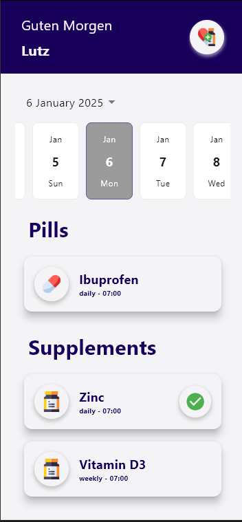
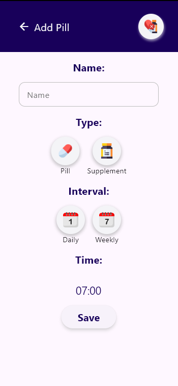

# PillNote - Your Pill Tracker

PillNote is a simple app built with Flutter to help you track and remember your pill and supplement intake. Whether it's daily medication, vitamins, or other supplements, this app makes it easy to set reminders, log your intake, and stay on top of your health.

## About This Project

PillNote was a fun project that allowed me to dive back into mobile development with Flutter. After taking a break from app development, it felt great to refresh my skills and build something useful. Flutter's simplicity and flexibility made the development process enjoyable, and I'm excited to continue learning and improving my mobile dev skills.

## Screenshots

Here are some screenshots of the PillNote app in action:

<div style="display: flex; gap: 20px;">

    
  

</div>

*Home Screen: View your daily pill reminders and log them.*  
*Add Pill Screen: Easily add new pills with dosage and reminder time.*  
*Screenshots taken on: January 6, 2025*

## Technologies Used

- **Flutter**: The framework used to build the app, enabling cross-platform mobile development.
- **Dart**: The programming language used for developing with Flutter.
- **SQLite**: For local storage and managing pill data (if used in the app).

## Installation

Clone this repository and use Flutter to run the app:

```bash
git clone https://github.com/lutz500/pill-note.git
cd pill-note
flutter run
